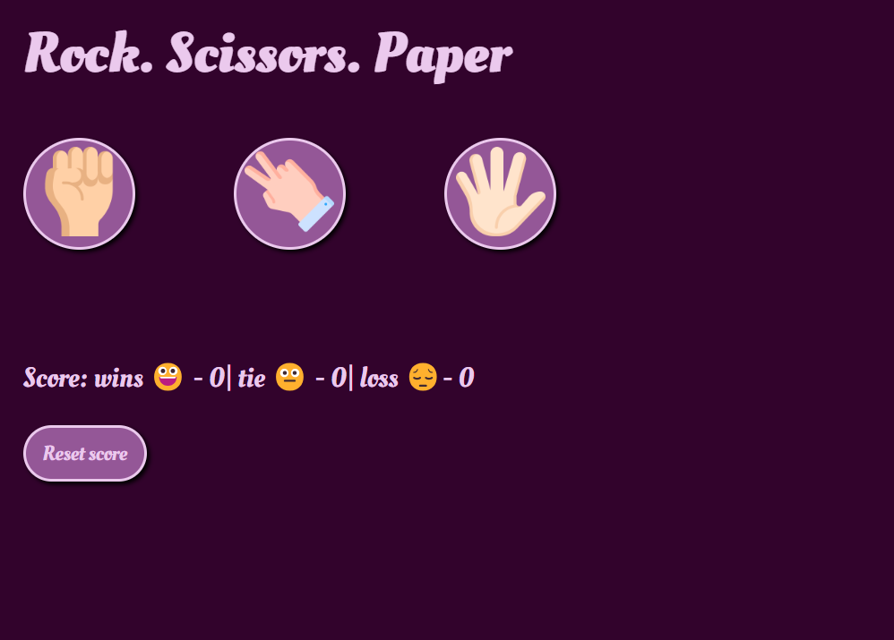
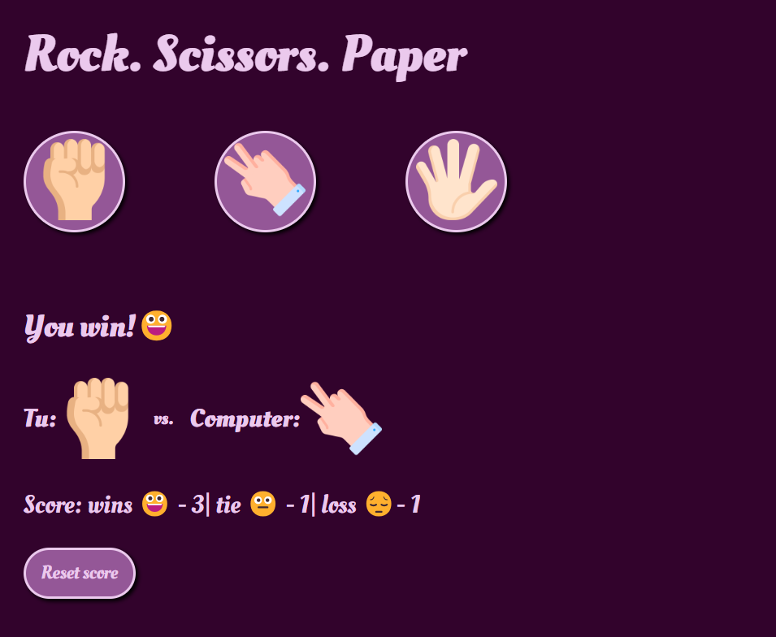

#Rock. Scissors. Paper
##WEB Project
  I tried to recreate the classic game "Rock. Scissors. Paper" in a web page using html, css and javaScript. 
This version gives players the opportunity to choose one of three game options and they will fight with the computer's random choice. 
Of course, the result and score are displayed. And, in addition, the player can choose to reset the score.
  The interface is in romanian.

The start look like this:

If the player chooses/clicks on one of the options: rock, scissors, paper, the computer chooses a random move and the result and score are displayed.

The player can reset the score by clicking the "Reset Score" button, and the page will look like it did at the beginning.